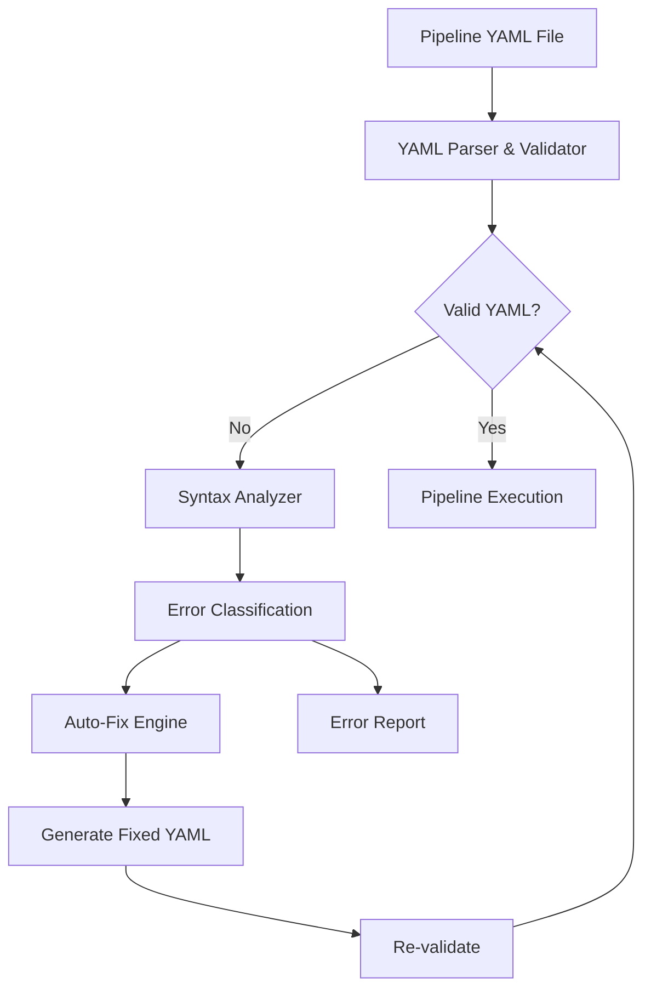

# Design Document - Pipeline YAML Validation

## Overview

This design addresses YAML parsing errors in Azure DevOps pipeline files by implementing a validation system that can detect, report, and fix common syntax issues, particularly the mixing of shell script heredoc syntax within YAML structure. The solution provides both validation capabilities and automated fixes to ensure pipeline files maintain proper YAML structure while preserving shell script functionality.

## Architecture

The validation system consists of three main components:

1. **YAML Parser & Validator**: Core validation engine that parses YAML and identifies syntax issues
2. **Syntax Analyzer**: Specialized component that detects mixed syntax patterns (shell scripts in YAML)
3. **Auto-Fix Engine**: Automated correction system that transforms problematic syntax into valid YAML



## Components and Interfaces

### YAML Parser & Validator

**Purpose**: Primary validation component that parses YAML files and identifies structural issues.

**Key Methods**:
- `validateYamlFile(filePath: string): ValidationResult`
- `parseYamlContent(content: string): ParseResult`
- `getErrorDetails(error: YamlError): ErrorDetails`

**Dependencies**: Standard YAML parsing library (PyYAML, js-yaml, or similar)

### Syntax Analyzer

**Purpose**: Specialized analyzer that detects mixed syntax patterns and shell script constructs within YAML.

**Key Methods**:
- `detectMixedSyntax(content: string): SyntaxIssue[]`
- `identifyHeredocPatterns(content: string): HeredocIssue[]`
- `analyzeShellScriptBlocks(content: string): ScriptBlock[]`

**Detection Patterns**:
- Heredoc syntax: `cat <<`, `EOF`, `EXAMPLE`
- Shell variable assignments in YAML context
- Unescaped shell commands in YAML values

### Auto-Fix Engine

**Purpose**: Automated correction system that transforms problematic syntax into valid YAML while preserving functionality.

**Key Methods**:
- `fixHeredocSyntax(issue: HeredocIssue): string`
- `convertToYamlLiteralBlock(shellScript: string): string`
- `applyAutomaticFixes(content: string, issues: SyntaxIssue[]): string`

**Fix Strategies**:
1. **Heredoc to YAML Literal Block**: Convert `cat <<'EOF'` patterns to YAML `|` syntax
2. **Proper Escaping**: Escape special characters in shell commands
3. **Indentation Correction**: Fix YAML indentation issues

## Data Models

### ValidationResult
```typescript
interface ValidationResult {
  isValid: boolean;
  errors: YamlError[];
  warnings: Warning[];
  fixSuggestions: FixSuggestion[];
}
```

### SyntaxIssue
```typescript
interface SyntaxIssue {
  type: 'heredoc' | 'mixed_syntax' | 'indentation';
  line: number;
  column: number;
  message: string;
  originalContent: string;
  suggestedFix: string;
}
```

### FixSuggestion
```typescript
interface FixSuggestion {
  description: string;
  originalText: string;
  replacementText: string;
  confidence: 'high' | 'medium' | 'low';
  preservesFunctionality: boolean;
}
```

## Error Handling

### Error Classification
1. **Critical Errors**: YAML structure violations that prevent parsing
2. **Syntax Warnings**: Mixed syntax that may cause issues but doesn't break parsing
3. **Style Issues**: Non-standard but valid YAML patterns

### Error Recovery
- **Graceful Degradation**: Continue validation even when encountering errors
- **Partial Fixes**: Apply fixes that have high confidence of success
- **Rollback Capability**: Preserve original file content for rollback if fixes fail

### Error Reporting
- **Precise Location**: Line and column numbers for all issues
- **Contextual Messages**: Clear explanations of what's wrong and why
- **Actionable Guidance**: Specific steps to resolve each issue

## Testing Strategy

### Unit Testing
- **YAML Parser Tests**: Validate parsing of various YAML structures
- **Syntax Analyzer Tests**: Test detection of different mixed syntax patterns
- **Auto-Fix Engine Tests**: Verify fixes preserve functionality and create valid YAML

### Integration Testing
- **End-to-End Validation**: Test complete validation workflow on real pipeline files
- **Azure DevOps Integration**: Verify compatibility with Azure DevOps YAML requirements
- **Regression Testing**: Ensure fixes don't break existing valid pipelines

### Test Data
- **Sample Pipeline Files**: Collection of valid and invalid YAML files
- **Edge Cases**: Complex shell scripts, nested structures, special characters
- **Real-World Examples**: Actual pipeline files from production environments

## Implementation Considerations

### Performance
- **Streaming Parser**: Handle large YAML files efficiently
- **Incremental Validation**: Only re-validate changed sections when possible
- **Caching**: Cache validation results for unchanged files

### Compatibility
- **Azure DevOps YAML**: Ensure compatibility with Azure DevOps pipeline schema
- **Shell Script Preservation**: Maintain exact shell script functionality after fixes
- **Cross-Platform**: Support Windows, Linux, and macOS environments

### Extensibility
- **Plugin Architecture**: Allow custom syntax analyzers for specific patterns
- **Rule Configuration**: Configurable validation rules and fix strategies
- **Custom Fix Templates**: User-defined fix patterns for organization-specific issues